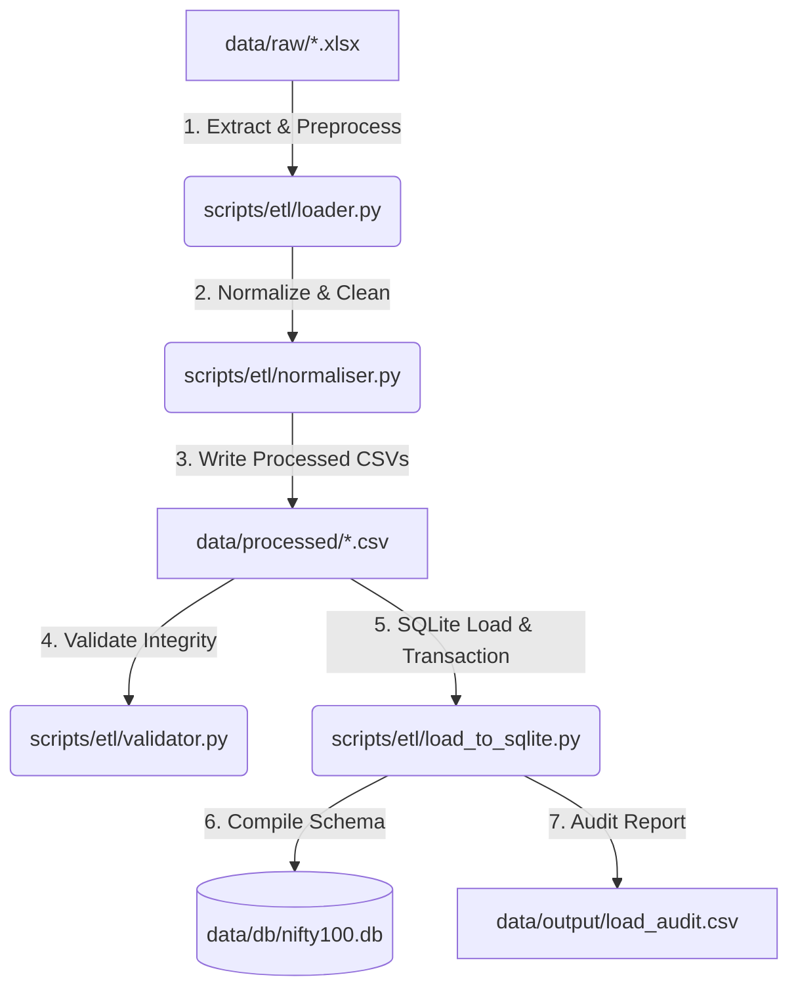

# Project Summary - Nifty 100 Financial Intelligence Platform

## 1. Project Overview
The Nifty 100 Financial Intelligence Platform is a data-engineering foundation designed to aggregate, clean, normalize, validate, and store corporate financial profiles, financial statements (Profit & Loss, Balance Sheets, Cash Flows), market valuations, analyst projections, and historical stock prices for Nifty 100 index companies. 

The primary objective is to transform raw, semi-structured Excel datasets into a structured, highly consistent, and clean SQLite database ready for financial modeling, analytics, and visualization.

---

## 2. ETL Workflow
The pipeline operates in three sequential phases:



1. **Extract**: Reads raw Excel sheets from `data/raw/` using Pandas. It dynamically handles the presence of top-level title banners and comments before identifying data rows.
2. **Transform (Normalize & Clean)**: 
   * Strips whitespace and normalizes ticker symbols (converting to uppercase and removing `.NS` suffixes).
   * Standardizes date formats and normalizes year notations (e.g. converting shorthand `FY20`, ranges `2020-21`, month prefixes `Mar 2020`, or floats `2024.5` to clean year strings like `2020` or `2024`).
   * Cleans and coerces missing, empty, or placeholder strings (e.g., `NaN`, `None`, `N/A`) into database-compatible `NULL` values.
3. **Load**: Performs transactional bulk inserts of CSVs into [nifty100.db](file:///C:/Users/Ridhi%20Kapoor/Desktop/Projects/Nifty100_Data_Foundation/data/db/nifty100.db) in dependency order (parent tables first). It generates stub records to resolve missing parent company keys and generates an execution report.

---

## 3. Database Design
The SQLite database [nifty100.db](file:///C:/Users/Ridhi%20Kapoor/Desktop/Projects/Nifty100_Data_Foundation/data/db/nifty100.db) comprises **10 related tables** structured in a star-like schema to enforce relational integrity:

* **companies** (Parent): Primary company details (symbol, name, face value, book value, website).
* **profitandloss** (Child): Corporate sales, expenses, operating profit, OPM, interest, net profit, EPS, and dividend payouts.
* **balancesheet** (Child): Assets, equity, liabilities, fixed assets, cwip, and investments.
* **cashflow** (Child): Cash from operating, investing, and financing activities.
* **analysis** (Child): Compounded growth metrics (sales, profit, stock price CAGR, and ROE).
* **financial_ratios** (Child): Standard ratios (margins, ROE, debt-to-equity, capex, and FCF).
* **market_cap** (Child): Valuation metrics (market cap, enterprise value, PE/PB ratios, EV/EBITDA, and dividend yield).
* **peer_groups** (Child): Ticker relationships mapping competitors and benchmark companies.
* **sectors** (Child): Sector categorization, index weightage, and capitalization categories.
* **stock_prices** (Child): Daily historical pricing (open, high, low, close, adjusted close, and volume).

---

## 4. Validation Process
Data quality rules are defined and checked inside [validator.py](file:///C:/Users/Ridhi%20Kapoor/Desktop/Projects/Nifty100_Data_Foundation/scripts/etl/validator.py). Validation is split into **Critical** (causes row rejection or stub generation) and **Warning** (logged for review) severities:

* **Primary Key Check (DQ-01)**: Ensures primary keys are not null.
* **Duplicate Primary Key Check (DQ-02)**: Flags duplicated business keys.
* **Foreign Key Check (DQ-03)**: Validates company IDs against parent keys.
* **Missing Field Check (DQ-04, DQ-05)**: Checks for empty mandatory fields.
* **Value Range Constraints (DQ-06 to DQ-09)**: Verifies that percentages, prices, and ratios are within logical limits.
* **Balance Sheet Equality (DQ-10)**: Verifies that `total_assets = equity_capital + reserves + borrowings + other_liabilities`.

---

## 5. Data Load Process
1. **Schema Initialization**: Executes [schema.sql](file:///C:/Users/Ridhi%20Kapoor/Desktop/Projects/Nifty100_Data_Foundation/sql/schema.sql) with `PRAGMA foreign_keys = ON;` to establish the tables.
2. **Referential Stub Generation**: Analyzes financial statements to check for companies referenced in datasets but missing in the parent `companies` table. It automatically creates basic stub profiles (e.g. `ZOMATO (Stub)`) to prevent constraint crashes.
3. **Bulk Insertion**: Loads data utilizing `executemany` database transactions for optimal load speeds.
4. **Referential Integrity Audit**: Triggers SQLite `PRAGMA foreign_key_check;` post-load to verify that no constraints are violated.

---

## 6. Key Achievements
* **Zero Integrity Violations**: Programmatically achieved clean foreign key verification.
* **100% Normalized Dimensions**: Resolved alternate symbols (e.g. mapping typo `AGTL` $\rightarrow$ `ATGL`) and fixed decimals like `'2024.5'` and formats like `'Mar-13'`.
* **Testing Coverage**: Maintained a suite of **66 unit tests** covering normalizer, validator, and loader functionalities.
* **Comprehensive Data Auditing**: Established standalone queries and scripts to easily run recurring quality checks.

---

## 7. Technologies Used
* **Language**: Python 3.12
* **Data Processing**: Pandas, OpenPyXL (Excel engine)
* **Storage**: SQLite 3
* **Testing**: PyTest
* **Visualizations**: SQL (exploratory scripts)

---

## 8. Folder Structure
```
Nifty100_Data_Foundation/
│
├── data/
│   ├── raw/                  # Source Excel spreadsheets
│   ├── processed/            # Cleaned and normalized CSVs
│   ├── db/                   # sqlite database (nifty100.db)
│   └── output/               # Audit reports and validation logs
│
├── notebooks/
│   └── exploratory_queries.sql # 10 Exploratory SQL queries
│
├── scripts/
│   ├── etl/
│   │   ├── loader.py         # Excel-to-CSV processor
│   │   ├── normaliser.py     # String & Year cleaner
│   │   ├── validator.py      # Quality validator
│   │   └── load_to_sqlite.py # SQLite builder & compiler
│   └── data_quality_audit.py # Auditing diagnostics script
│
├── sql/
│   ├── schema.sql            # Database schema script
│   └── data_quality_audit.sql # SQL validation checks
│
├── tests/
│   └── etl/                  # Pytest unit tests
│
├── Makefile                  # Tasks script runner
├── SPRINT1_RETROSPECTIVE.md  # Sprint 1 retro report
├── DELIVERABLES.md           # Checklist of deliverables
└── PROJECT_SUMMARY.md        # Technical design document
```

---

## 9. Next Sprint Goals
* **Automated Duplication Resolution**: Implement automated cleaning steps to deduplicate exact matches rather than just reporting them.
* **Incremental Loader**: Transition from drop-and-reload architecture to incremental upserts.
* **Analytics Views**: Implement database Views for common analytical joins (e.g., combining P&L, balance sheets, and valuations).
* **API/CLI Access**: Develop lightweight query endpoints or CLI utilities to query stock prices and financial ratios quickly.
